# US Wildfire Prediction

Dự án ML dự đoán cháy rừng tại Mỹ, dựa trên dữ liệu FPA FOD mở rộng (1992–2026).

## ⭐ Tầng 1 — Dự báo KHẢ NĂNG PHÁT CHÁY (bản đồ rủi ro, California)

Khác với các model "mô tả cháy đã biết" (quy mô/nguyên nhân), đây là model **dự báo nơi/lúc sẽ phát cháy** — đúng mục tiêu gốc. Cách làm:
- **Panel space-time**: lưới ~0.25° × **tuần**, California 2015–2020 (393k ô-tuần; ô-tuần không cháy = mẫu âm tự nhiên). Tỉ lệ cháy 7.5%.
- **Feature nhân quả từ gridMET** (lưới 4km, OPeNDAP): ERC, Burning Index, độ ẩm nhiên liệu chết (fm100/fm1000 — proxy hạn hán), gió, nhiệt độ, độ ẩm, mưa, VPD; + **địa hình** (độ cao) + **lịch sử cháy** 1992–2014 + mùa.

| Đánh giá | ROC-AUC | PR-AUC | base |
|---|---|---|---|
| Temporal (train 2015–2019 → **test 2020**) | **0.932** | **0.583** | 8.2% |
| Spatial block CV (giữ vùng chưa thấy) | 0.908 | 0.383 | — |

**Thực dụng:** trong tuần cao điểm 2020, **top-20 ô rủi ro cao nhất → 95% thực sự có cháy** (top-50: 88%, top-100: 81%). Feature mạnh nhất: lịch sử cháy, độ cao, độ ẩm (rmin), độ ẩm nhiên liệu (fm1000), nhiệt độ — đúng các yếu tố nhân quả.

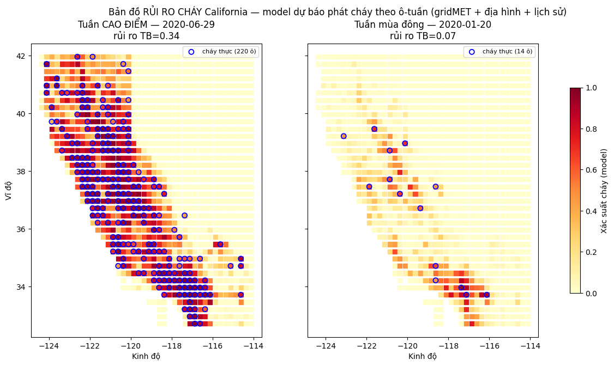

Pipeline: `src/build_ca_panel.py` → `build_ca_features.py` → `train_occurrence.py` → `make_risk_map.py`.
Cần `xarray`, `netCDF4` (đọc gridMET OPeNDAP). Hạn chế POC: mới làm cho California; tổng quát sang *vùng* mới kém hơn sang *năm* mới; chưa có PDSI (thay bằng fm1000/ERC).

## Cấu trúc thư mục

```
usforestfire_predict/
├── data/
│   ├── raw/         # dữ liệu gốc, KHÔNG chỉnh sửa
│   │   └── FPA_FOD_20170508.sqlite        # FPA FOD 1992–2015 (SpatiaLite, 1.88M)
│   ├── interim/     # dữ liệu trung gian (3 nguồn đã ghép)
│   │   ├── fires_extended.sqlite          # bảng fires_all (phẳng, có DATA_SOURCE)
│   │   └── fires_extended.csv
│   └── processed/   # dữ liệu sạch + feature, sẵn sàng train
│       ├── fires_ml.sqlite                # bảng fires_clean (32 cột)
│       └── fires_clean.csv
├── src/
│   ├── build_extended.py   # ghép 3 nguồn (raw → interim) qua ArcGIS REST API
│   ├── process_data.py     # làm sạch + feature engineering (interim → processed)
│   └── eda.py              # sinh biểu đồ EDA → reports/figures
├── reports/figures/        # 8 biểu đồ PNG
├── logs/                   # log chạy pipeline
├── models/                 # (sắp tới) model đã train
└── README.md
```

## Nguồn dữ liệu & độ phủ

| Giai đoạn | Nguồn | Bản ghi | Ghi chú |
|-----------|-------|---------|---------|
| 1992–2015 | FPA FOD `20170508` (gốc) | 1,880,465 | đã làm sạch |
| 2016–2020 | FPA FOD 6th edition (USFS) | 381,951 | đã làm sạch |
| 2021–2026 | NIFC WFIGS (IRWIN, chỉ WF) | 211,558 | dữ liệu vận hành |
| **Tổng (sau làm sạch)** | | **2,473,778** | |

## Pipeline (chạy lại)

```bash
python3 src/build_extended.py   # raw → interim  (tải qua API, ~50 phút)
python3 src/process_data.py     # interim → processed (fires_ml.sqlite)
python3 src/eda.py              # → reports/figures
python3 src/build_features.py   # feature lịch sử + owner → fires_model.sqlite
python3 src/train_model.py      # train + tinh chỉnh → models/ + reports/
```

## Model: dự đoán cháy lớn (IS_LARGE_FIRE, ≥100 acres)

Chống leakage (không dùng FIRE_SIZE/DURATION). Chia theo thời gian: train ≤2017, test 2018–2020.
Feature lịch sử time-aware (`hist_cell_rate` = tỉ lệ cháy lớn quá khứ của ô lưới 0.25°) là yếu tố mạnh nhất.

| Model | ROC-AUC | PR-AUC (test) | base rate |
|---|---|---|---|
| Baseline v1 (HGB, feature cơ bản) | 0.844 | 0.170 | 2.72% |
| LogReg (feature đầy đủ) | 0.851 | 0.190 | 2.72% |
| **HGB tuned + feature lịch sử/mùa-vụ/khoảng cách** | **0.871** | **0.221** | 2.72% |

Feature mạnh nhất (tương quan & importance): `hist_cell_rate` > `hist_cellmonth_rate` (mùa-vụ) > `STATE` > `dist_largefire_log`.
Biểu đồ: `reports/figures/corr_*.png`, `model_*.png` (ROC/PR, ngưỡng, nhầm lẫn, hiệu chuẩn).

### So sánh thuật toán boosting (bước 2)

| Model | PR-AUC test | PR-AUC OOD |
|---|---|---|
| HGB (sklearn) | 0.221 | **0.210** |
| **LightGBM** | **0.226** | 0.206 |
| XGBoost | 0.225 | 0.186 |

LightGBM nhỉnh nhất trên test (lưu ở `models/large_fire_best.joblib`) nhưng khác biệt giữa 3 thuật toán là rất nhỏ (~2%); HGB tổng quát hoá sang dữ liệu mới (OOD) tốt nhất. **Kết luận: feature engineering quan trọng hơn nhiều so với chọn thuật toán.** Cần `libomp` (`brew install libomp`) cho LightGBM/XGBoost.

### Bài toán bổ sung (bước 3) — `src/train_extra_tasks.py`

Thêm 2 model (không thay thế model cháy lớn), cùng split thời gian, chống leakage:

| Bài toán | Model | Kết quả (test 2018–2020) | Artifact |
|---|---|---|---|
| Hồi quy `log(diện tích)` | LightGBM Regressor | R²=0.247, MAE(log)=0.73, median \|err\|=0.85 acres | `models/fire_size_lgbm.joblib` |
| Phân loại nguyên nhân (12 lớp) | LightGBM multiclass | accuracy=0.394 (baseline 0.348), macro-F1=0.28 | `models/fire_cause_lgbm.joblib` |

Nguyên nhân tách tốt nhất: **Lightning** (F1 0.64) và **Fireworks/Campfire** (đặc trưng mùa & vị trí rõ); các nguyên nhân do người (Equipment/Smoking/Children) dễ nhầm lẫn. Biểu đồ: `reports/figures/size_regression.png`, `cause_confusion.png`.

## Biểu đồ

### EDA — khám phá dữ liệu

Số vụ cháy theo năm (tô màu theo nguồn — thấy rõ đứt gãy độ phủ ở 2021):

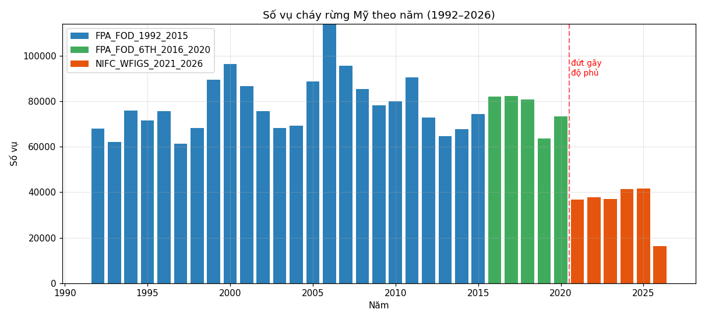

| Phân bố không gian | Cường độ Năm × Tháng |
|---|---|
| 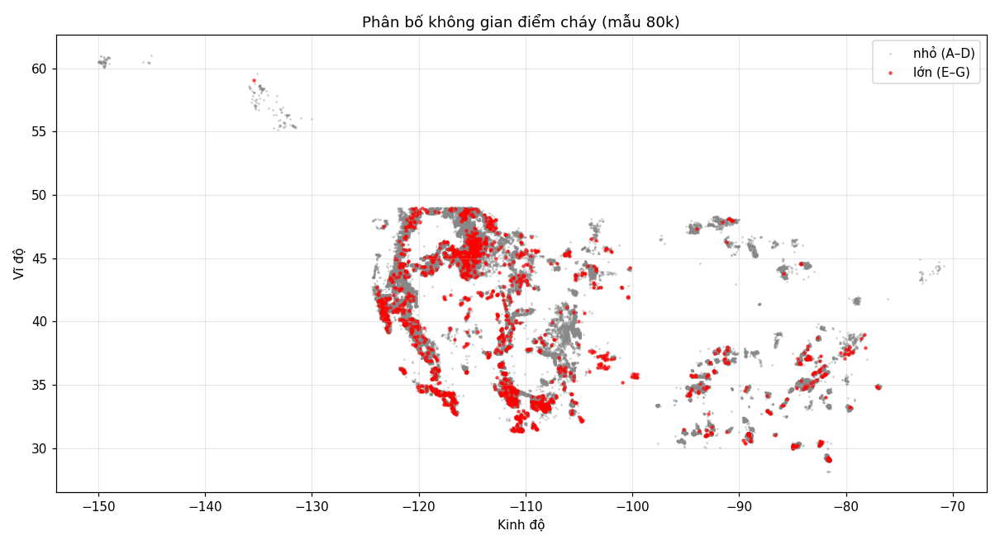 | 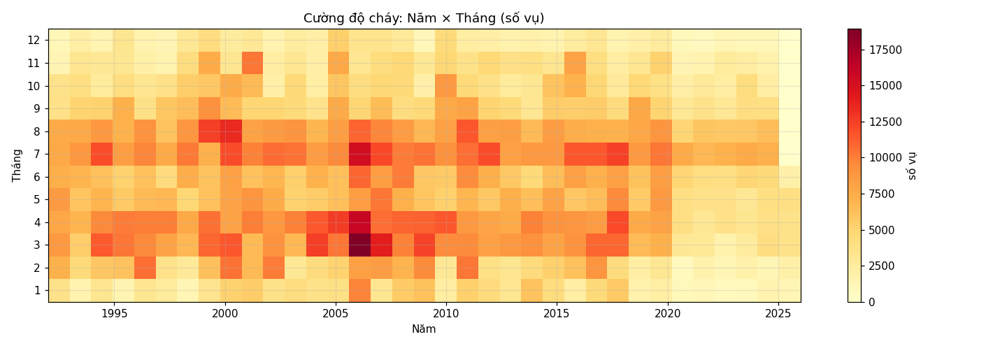 |

| Nguyên nhân | Top bang |
|---|---|
| 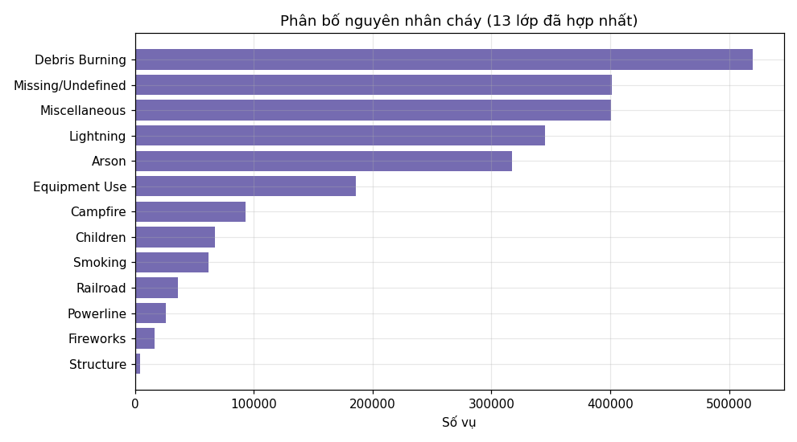 | 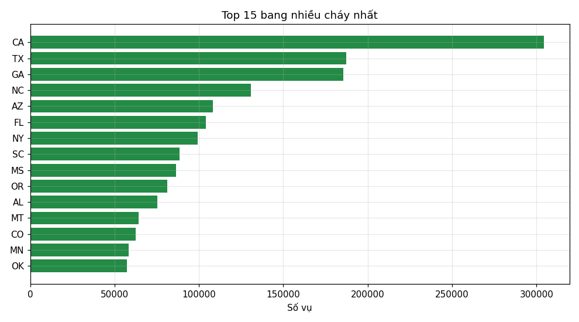 |

### Tương quan & chỉ số mô hình

| Tương quan với cháy lớn | So sánh thuật toán |
|---|---|
| 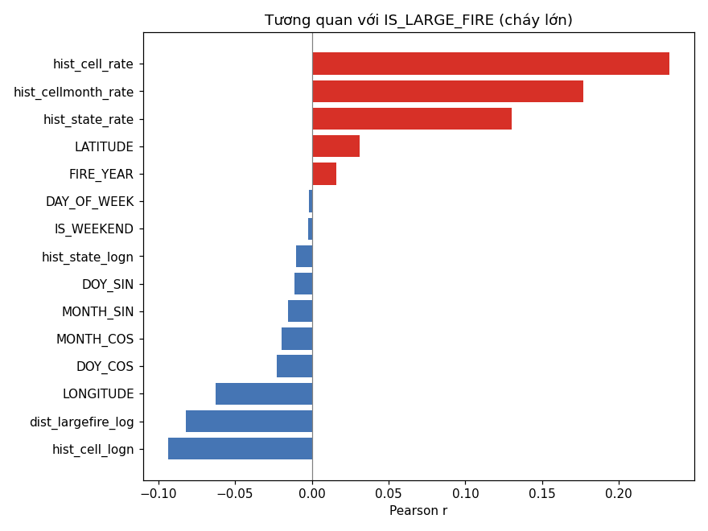 | 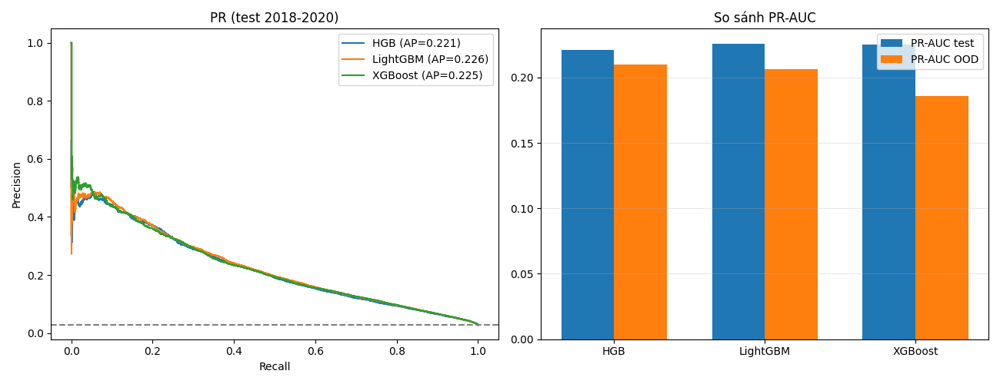 |

| ROC & Precision-Recall | Precision/Recall/F1 theo ngưỡng |
|---|---|
| 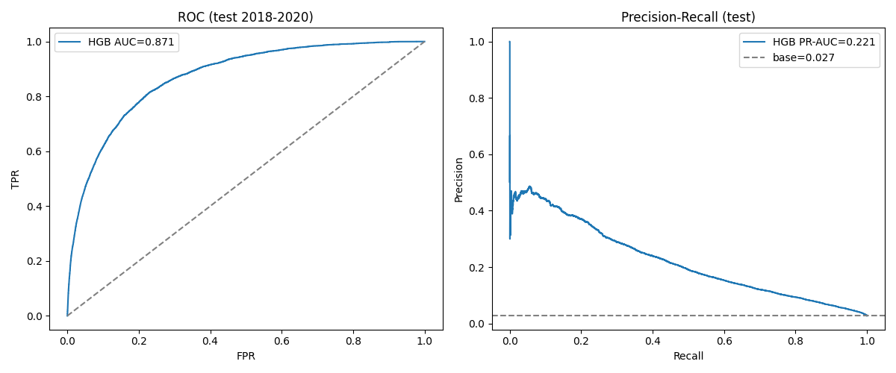 | 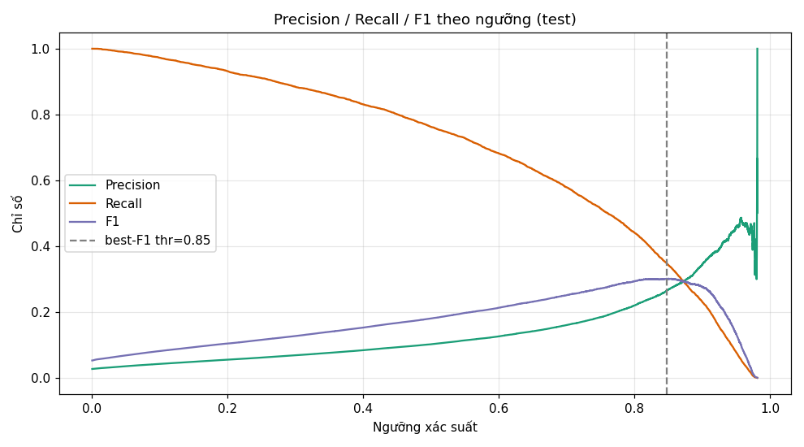 |

| Độ quan trọng feature | Hiệu chuẩn xác suất |
|---|---|
| 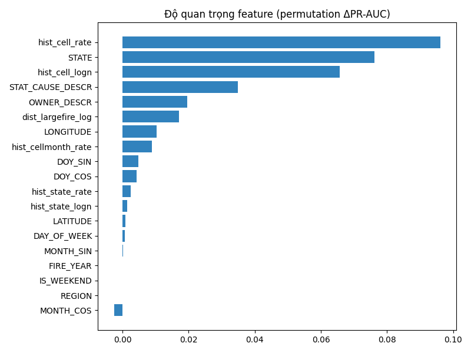 | 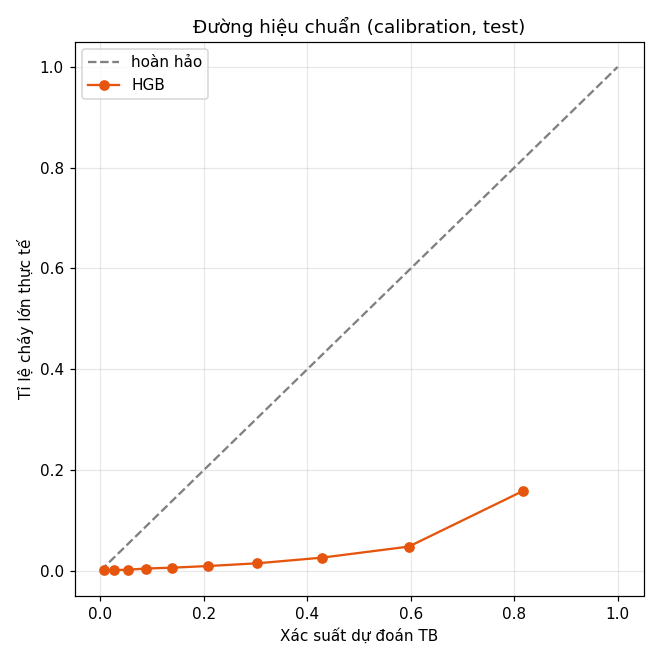 |

### Bài toán bổ sung

| Hồi quy diện tích cháy | Nhầm lẫn nguyên nhân (12 lớp) |
|---|---|
| 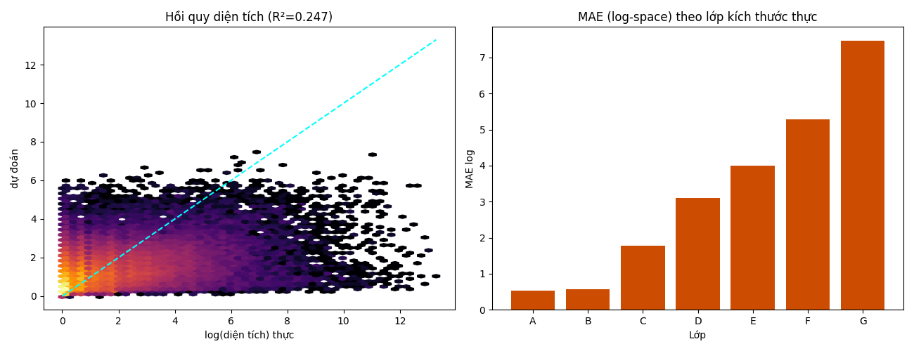 | 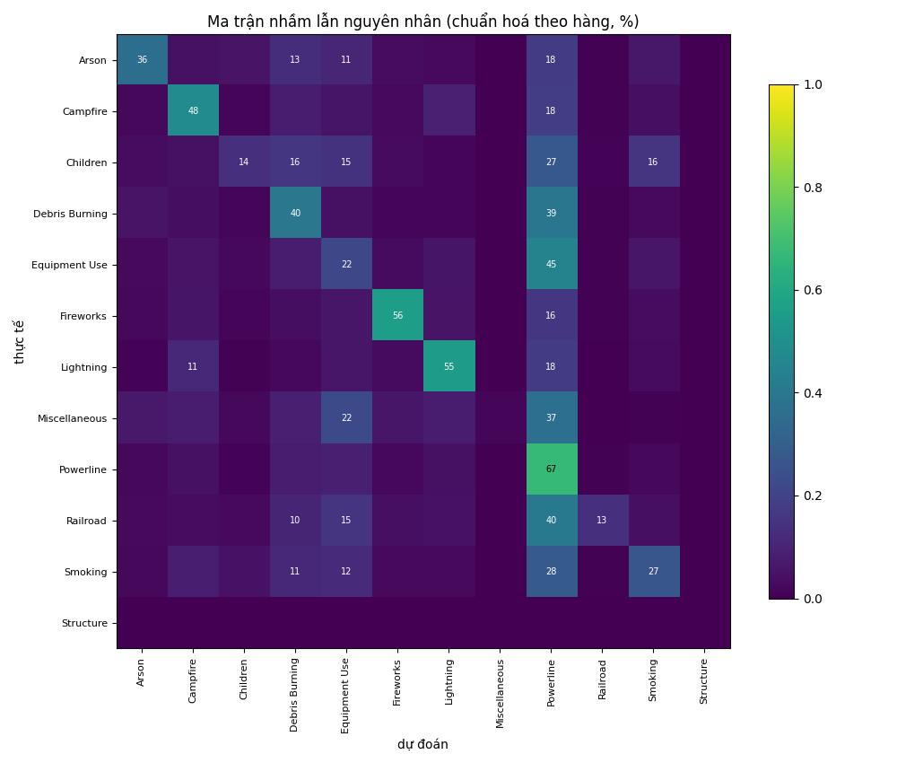 |

## Cảnh báo dữ liệu (quan trọng khi train)

- **Đứt gãy độ phủ ở 2021**: NIFC chỉ ~37–41k cháy/năm so với ~73k/năm của FPA FOD (bỏ sót cháy nhỏ). Dùng cột `DATA_SOURCE` để lọc hoặc làm biến kiểm soát.
- Độ tin cậy nhãn nguyên nhân giảm theo nguồn: `CAUSE_KNOWN` 91% → 66% → 51%.
- NIFC thiếu toạ độ ~17% (`GEO_VALID=0`).
- **2026 là năm dở dang** (tới ~tháng 6) — không dùng làm năm đếm đủ.
- Để dự đoán cháy *tương lai* đúng nghĩa cần ghép thêm dữ liệu thời tiết/khí hậu (chưa làm).

## Môi trường

Python 3.9 — `pandas`, `numpy`, `matplotlib`, `scikit-learn`. (Chưa có `seaborn`, `pyarrow`.)
